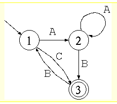
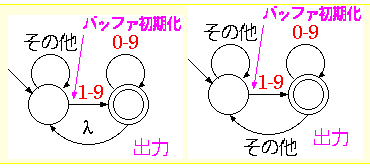

# オートマトン

## Rei.java

入力A,B,Cによって各STATEに移動。移動できない時はRejectと出力。

## Rei2.java

Reiと同じオートマトン、コードの書き方が違う。switch-case文を取り除いたもの。
※Java特有の書き方で実装

## Rei3.java
正規表現の入力、みたいなもの。文字列のパターンマッチング。
`$ java Rei3 入力1(pattern) 入力2(string)`
stringの中にいくつpatternがあるかをカウントして出力するもの。

## Rei4.java

入力より、1以上の数字を取り出すもの。「-」「.」などは文字列として処理。
例:『vy8dshshvd9s8vh9ad → 8 9 8 9』　みたいな感じ。

## Rei4usingLib.java
ライブラリが既にあるのでついでに使ってみる。
